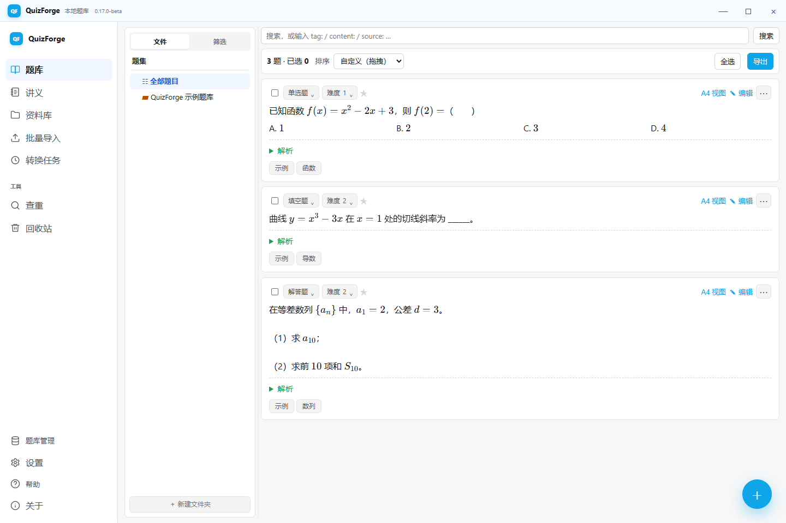
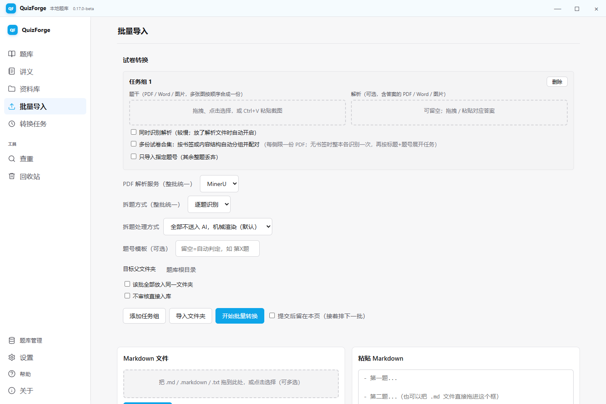
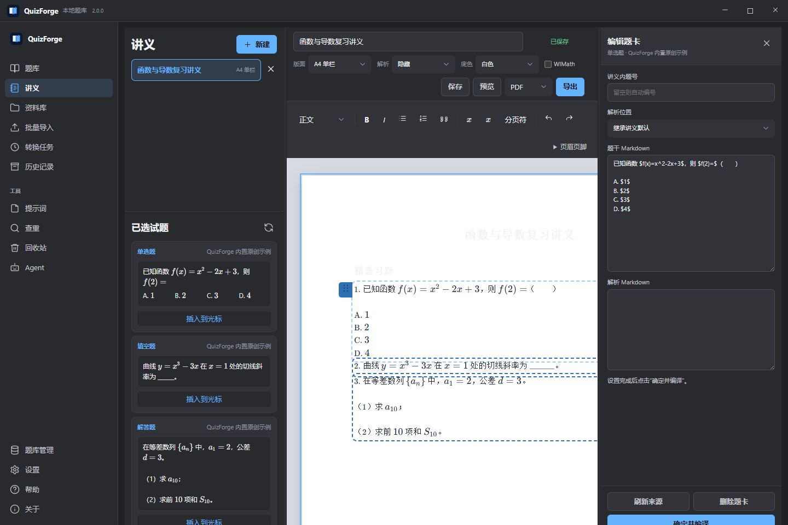

<p align="center">
  
</p>

<h1 align="center">QuizForge</h1>

<p align="center"><strong>把散落的试卷，整理成真正属于你的本地题库。</strong></p>

<p align="center">
  <a href="https://github.com/lhd23333/QuizForge/releases">下载 Windows 版</a> ·
  <a href="docs/PRODUCT.md">了解全部功能</a> ·
  <a href="CHANGELOG.md">查看更新记录</a> ·
  <a href="README.en.md">English</a>
</p>

QuizForge 是面向教师、学生和内容整理者的开源数学／物理题库工具。你可以把 PDF、Word 或图片试卷识别成题目，在文件夹中分类、搜索和修改，再拖进讲义或组卷篮，导出 PDF、Word、Markdown、TeX 或 Overleaf ZIP。

题目与图片保存在你的电脑上，不需要账号、邀请码或设备激活。自动识别属于可选能力：需要时填写自己的 MinerU、Doc2X 或大模型 API，不配置也可以手动建题、整理题库和导出。



## 一份试卷如何变成题库

| 1. 放入试卷 | 2. 检查识别结果 | 3. 整理与复用 | 4. 生成成品 |
|---|---|---|---|
| 拖入 PDF、Word、图片或 Markdown | 机械拆题，或按需交给自己的 AI 调整 | 用文件夹、标签、难度和搜索管理题目 | 制作讲义、试卷、刷题册或课堂课件 |

批量任务可以同时放入题干和解析，也能处理多份试卷合集；程序遇到不确定的分组或缺失内容时会停下来让你校对，不会悄悄猜测后直接写入题库。

每组识别都会把原文件和最终 Markdown 放进本机“历史记录”。你可以在资料库中继续编辑识别 Markdown，也可以随时从历史直接建立一组待审核任务，不必重新调用 OCR。

### 批量导入

一次放入多份题干与解析，统一选择 OCR 和拆题方式；任务在后台运行，完成一组就可以先审核一组。



### 讲义编排

从选题篮取题，直接拖进分页画布；题号、解析、纸张和导出格式都在同一处调整。



## 你可以做什么

- **建立自己的题库**：每题都是普通 Markdown 文件，文件夹就是目录；可用 QuizForge 或 Obsidian 打开，不被专有数据库锁住。
- **快速找到旧题**：按文件夹、标签、题型、难度和星标筛选，也可搜索题干、解析、备注与题源；查重只在你点击后运行，并可暂停。
- **整理识别结果**：MinerU 与 Doc2X 都支持多份本机凭据轮转；拆题可选纯机械、逐题 AI 或整篇 AI，识别失败时保留原文供人工调整后重试。
- **保留识别历史**：原卷与最终 Markdown 按题库归档，可在资料库查看和编辑；删除先进入历史回收站，旧结果可直接再次提取。
- **在资料库处理与制卡**：用 WebView2 阅读 PDF，安全编辑 Markdown，移动或 Shift 复制文件；PDF 页面工具、DOCX 按需转换和 Markdown／PDF／图片制卡都作为后台任务执行，失败后可明确重试。
- **编排讲义和试卷**：把题目拖进固定纸张画布，调整题号、解析位置、分页和图片布局；可导出 PDF、DOCX、Markdown、TeX 或带图片 ZIP。
- **保留自己的数据**：题库、图片、API 配置和界面设置都在本机；检查更新不会上传题目、路径或密钥。

## 开始使用

### 普通 Windows 用户

首个公开安装包仍在准备中。正式发布后，从 [GitHub Releases](https://github.com/lhd23333/QuizForge/releases) 下载最新的 `QuizForge-<版本>-Setup.exe` 并安装；以后无需卸载旧版，可在软件“设置”或“关于”页点击“检查更新”，也可以继续从 Releases 手动下载新版覆盖安装。

首次启动只需选择一个题库文件夹。空文件夹会得到 3 道原创示例题，已有 Markdown 的目录不会被注入或改写。需要自动识别时，再到“设置”中添加自己的 OCR 与模型 API。

直接生成 PDF 需要本机安装 MiKTeX 或 TeX Live；没有 TeX 环境时，仍可使用 HTML/KaTeX 预览，或导出 `tex.zip` 上传到 Overleaf。Windows 安装包会自带 Pandoc，因此 Word、Markdown、TeX 和 ZIP 导出不依赖单独安装 Pandoc。

### 从源码运行

需要 Windows 与 Python 3.11+：

```powershell
git clone https://github.com/lhd23333/QuizForge.git
cd QuizForge
python -m venv .venv
.venv\Scripts\pip.exe install -r requirements.txt
.venv\Scripts\python.exe app.py
```

然后打开 <http://127.0.0.1:5000>。这个本地服务没有账号鉴权，只能在自己的电脑上使用，**不要暴露到公网或局域网**。

## 下载、更新与参与

- [Releases](https://github.com/lhd23333/QuizForge/releases)：下载安装包或手动更新。
- [CHANGELOG](CHANGELOG.md)：了解每个版本增加、修复和移除了什么。
- [参与贡献](CONTRIBUTING.md)：搭建开发环境、提交 Issue 或 Pull Request。
- [安全策略](SECURITY.md)：私密报告安全问题，避免公开真实密钥或题库。
- [隐私政策](PRIVACY.md)：查看主动更新检查与用户自选第三方服务的联网边界。
- [Code signing policy](docs/CODE_SIGNING_POLICY.md)：查看 Windows 构建来源、签名角色与人工批准规则。
- [发布维护手册](docs/RELEASING.md)：维护者构建新版本、发布 GitHub Release 和开启一键更新的完整流程。

QuizForge 按 [GNU GPL v3.0 或更高版本](LICENSE) 开源。你可以在许可证允许的范围内使用、研究、修改和再分发。

### Code signing policy

Free code signing provided by SignPath.io, certificate by SignPath Foundation

服务链接：[SignPath.io](https://signpath.io/) · [SignPath Foundation](https://signpath.org/)

SignPath Foundation 审核尚未完成。当前 GitHub Actions 只构建短期保留的未签名候选供来源验证，不创建 Release；公开安装包必须在签名、哈希复验和覆盖升级验收全部完成后发布。角色、构建来源和隐私声明见 [完整代码签名政策](docs/CODE_SIGNING_POLICY.md)。

<details>
<summary><strong>开发、构建与实现细节</strong></summary>

下面保留完整的实现边界、构建方式和兼容说明，普通用户无需阅读。

## 产品与更新文档

- [产品全景](docs/PRODUCT.md)：八个产品板块的定位、用户价值、核心原则、安全／兼容边界与当前成熟度。
- [更新记录](CHANGELOG.md)：从 `0.17.0-beta` 起维护用户可感知变更，开发期内容进入 `[Unreleased]`，作为正式更新公告的事实来源。
- [迁移说明](迁移说明.md)：服务器版向软件版迁移及早期演进的技术历史档案，不再承担后续主更新日志。

日常业务修改在源码验证通过后，使用 `update_installed.ps1 -DirectBundle` 原位覆盖本机日常安装版并启动验收，默认不生成 Setup。只有明确要求构建安装包或正式发布时，才运行 Inno Setup 和覆盖升级验证。

## 独立桌面初版

源码与日常安装目录版已经定稿为 `1.0.0`（文件版本 `1.0.0.0`）。本机和 GitHub Actions 生成的未签名 Setup 候选只用于构建验收与 SignPath 接入；它们不是公开发行包，也不会上传到 Releases。公开安装包将在可信 Windows 代码签名和覆盖升级验收完成后发布。

历史 `0.17.0-beta` 测试包只保留在维护者本机，不进入仓库。发布前的目录版原位覆盖已经验证：程序升级到 `1.0.0` 后，题库登记、任务状态、OCR／LLM 配置、界面设置及历史兼容文件均保持不变。

更新时不需要先卸载：正式分发可运行新版安装包并沿用原安装目录；只更新本机时可执行 `.\update_installed.ps1 -DirectBundle`，只重建桌面目录并覆盖程序文件，不生成安装包。题库登记、转换任务、加密密钥、OCR／LLM 配置、设备身份和旧兼容文件独立保存在 `%LOCALAPPDATA%\QuizForge` 或用户选择的题库目录，更新器会在覆盖与启动前后核对这些受保护数据。联网更新只在“关于”页由用户主动检查，清单请求只发送版本和平台信息；发现带 SHA-256 和 Authenticode 证书指纹的已签名新版本后，可由用户再次确认并一键下载、覆盖和重启，不会在后台擅自更新。

桌面版使用无边框原生窗口和自绘标题栏，题库、导入、任务、设置等栏目采用固定左侧导航，窄屏自动收为图标轨道；详细操作说明从左下角“帮助”按当前页面打开。桌面窗口内部使用常驻工作区，从左侧切换栏目时资料库只隐藏、不销毁，已打开的 PDF 和分栏状态会在后台保留；浏览器与 Obsidian 模式继续共享同一套业务页面。

程序会在本机随机端口启动既有 Flask 后端，再用系统 WebView2 打开桌面窗口。窗口采用无黑边的自绘标题栏，并支持从四边和四角自由拖动缩放。首次启动选择题库文件夹；若该目录完全没有 Markdown，程序会创建一个独立的“QuizForge 示例题库”，放入 3 道原创示例题，已有题库绝不注入。之后可从顶部“题库”打开类似 Obsidian 的题库列表：登记已有 Obsidian vault 或普通文件夹、创建空题库、切换当前题库，或仅从列表移除记录；移除记录永远不会删除磁盘文件。旧版单一 `bank_dir` 配置会自动加入列表，不搬迁题目。欢迎/关于页会检查当前题库与数据目录、Pandoc、XeLaTeX、磁盘空间和离线服务状态，并提供打开当前题库、日志和数据目录的入口。程序配置、日志和临时产物默认放在 `%LOCALAPPDATA%\QuizForge`，题目仍是各自题库目录里的普通 Markdown 文件。

软件版不提供账号、云 OCR 或云 TeX。MinerU、Doc2X 和 LLM 都由用户在设置页配置自己的凭据，并使用本机加密存储；MinerU 与 Doc2X 支持多份 Key 按忙闲和轮转使用。PDF 可用本机 XeLaTeX 生成，也可以导出 `.tex.zip` 到 Overleaf；没有 TeX 环境时仍可使用 HTML/KaTeX 近似预览。

安装包已经内置 Pandoc 3.9.0.2，所以新电脑可直接导出可继续编辑的 `.docx`、`.tex` 和含图片的 `tex.zip`。当前版本暂不捆绑完整 TeX 发行版；MiKTeX 25.12 官方 Basic Installer 与 Setup Utility 均未提供有效 Authenticode 签名，因此设置页的一键安装按安全策略关闭，不会下载或执行未签名程序。需要本机 PDF 时可自行安装可信来源的 MiKTeX/TeX Live，也可导出 `.tex.zip` 到 Overleaf 或使用 HTML/KaTeX 近似预览。第三方说明见 [`installer/THIRD_PARTY_NOTICES.md`](installer/THIRD_PARTY_NOTICES.md)。

开发环境重新构建：

```powershell
.venv\Scripts\pip.exe install -r requirements-desktop.txt
npm.cmd install
npm.cmd run build:handouts
.\build_desktop.ps1
.\build_installer.ps1
```

提交或发布前可统一运行完整源码验证；生成桌面目录版后去掉 `-SkipBundleScan`，会继续检查发行文件中是否混入源码或私密数据：

```powershell
powershell.exe -NoProfile -ExecutionPolicy Bypass -File tools\verify_release.ps1 -SkipBundleScan
```

桌面构建脚本优先选择可用的 Nuitka；当前 Python 3.13 且没有 MSVC 时自动回落到 PyInstaller。安装器使用 Inno Setup 6，并展示及安装仓库根目录的 GPL 文本。正式公开安装包仍需完成 Windows 代码签名和覆盖升级验收。

旧 `quizforge-cloud/`、`license.qflicense`、`activation.json`、设备身份和账号缓存仅作为历史回退资料保留；开源版不读取或校验这些数据，覆盖更新也不会删除它们。

## 功能

- **题目导入**：支持粘贴 Markdown、上传 PDF/Word/图片（AI 识别）、批量导入多份试卷；文件可拖放上传，也能从文件夹一键导入并按文件名自动配对「题干 + 答案」。对于“一本题干合集 PDF + 一本答案合集 PDF”，在任务卡勾选“多份试卷合集”后，有试卷首页书签时会在 OCR 前快速拆卷；没有书签时不裁切 PDF，而是把题干册和解析册各整本 OCR 一次。程序优先用可靠的结构标题和后续题号确认边界，但标题不是必需条件：可靠标题不足 2 个时，可根据多组题号回到 1 自动分组，例如 `1…19 → 1…19` 会在 `19｜1` 之间拆卷。为避免把小问或题型切换误当新卷，每组必须从 1 开始、至少有 5 个不同题号、题号覆盖率至少 85%，相邻组题号集合重合至少 80%；解析侧还必须得到相同组数并逐组满足题号重合。“第×份参考答案”这类普通标题可在序号和题号覆盖都一致时配对；个别题解析缺失会记录题号并留空，其余题仍可正常入库，不按位置错配。若双方已经出现明确但互相冲突的标题、标题重名、组数不等或专题对应不上，仍会停止，不按页序猜答案。合集内少量 A–D 选项文字被右侧插图挤掉时，只有在原题壳唯一、完整候选唯一且 MinerU 坐标证明文字列位置的情况下，才对对应单页做有界补识别并把选项文字合回原题干和原图；任何歧义都保留待复核。Doc2X 合集会在初次识别和缓存重试时按页面坐标恢复跨题图片及唯一四图选项，重复执行不会继续搬图。校对页可给每道题额外加入最多 20 张图片，立即预览、拖动排序并选择位置与上下／左右排列；确认后才保存进 `_assets`。带图选择题默认仅选项分栏，解答题默认仅小问分栏，填空题默认题干分栏，多图默认上下排列。目标文件夹在打开选择器后逐层加载，进入导入页不再递归扫描整棵题库。OCR 可逐批选择 MinerU 或 Doc2X v3，后续再独立选择整篇 AI、逐块 AI 或纯机械拆题。机械拆题会展开带“题号／答案”首列的标准答案表，并在整批题号唯一、连续且完整时按题号归序；重复或缺号时不猜测重排。导入只检查本次内容内部的重复块，不再为每次导入扫描整个历史题库；跨批次或历史重复请按需打开「查重」。选择题标签会在边界明确时统一为 A.–D.，概率事件 A/B 等歧义保留待复核；解答题连续小问自动分段；OCR 结构异常只在强证据成立时机械修复，否则进入校对提示
- **合集识别失败后的人工调整**：结构标题或题号不足以可靠分组时，失败任务保留已经完成的 OCR 缓存，并提供左侧原文件、右侧 Markdown 的对照编辑页。修改后可选择“整份作为一组”或“按标题拆成多组”，再点“尝试识别”；重试只读取修改后的缓存，不再次调用 MinerU 或 Doc2X
- **图片与批量识别防丢**：同一题干或解析框中的多张图片按选择顺序逐页合成 PDF，任何一张损坏都会让该组明确失败，不生成缺页半成品；同组多份 PDF／Word 或图片与文档混选会直接拒绝，不再只取第一份。纯图片 `.docx` 会按文档内图片顺序逐图一页，避免 Pandoc 把整页扫描图压缩挤页。MinerU 强制 OCR 重试与首轮附件各自隔离，只采用正文、题号和图片覆盖更完整的结果；高置信正文缺失、题号缺口、模型删掉原图引用或 OCR 附件损坏时会标记 `【必须人工校对】` 并暂停自动入库。最终图片按内容摘要存入 `_assets`，重复转换可复用相同文件，内容不同的同名图不会覆盖旧题资产
- **MinerU 下载可恢复**：服务端识别完成后的结果 ZIP 以流式临时文件下载；连接中断时最多 6 次从已收字节继续，并校验 Range、ZIP 成员 CRC 与解压结果。任务工作区只保存 batch_id、源文件摘要、解析参数和 Token 指纹，不保存 Token 明文或带签名下载地址；点击“重新转换”会优先用原 Token 查询同一服务端任务并续传，不会重新上传整本或重复 OCR。由旧版本创建、且失败前没有留下 batch_id 的任务不具备这一恢复能力
- **可靠的多批转换**：一次排多组任务，后台并发识别（默认同时 3 组），支持单组中止、批次翻页和重启后继续审核已完成结果
- **拆题人工审核**：逐题识别默认“全部不送入 AI”并机械渲染；也可主动改为切块后送 AI，或先人工调整块的合并/拆分/顺序再送 AI
- **AI 识别**：PDF/Word/图片 → MinerU 或 Doc2X OCR → DeepSeek（或任意 OpenAI 兼容模型）规范化，也可跳过 LLM 直接机械拆题
- **题库管理与原地编辑**：文件夹分类、标签、难度、题型筛选，去重检测，回收站（软删除可恢复）；搜索支持普通文本及 `tag:`、`content:`、`solution:`、`note:`、`source:`、`type:`、`difficulty:`、`starred:` 结构化条件，并始终在当前文件夹和已启用筛选的完整题目范围内执行。独立桌面端侧栏使用“文件/筛选”双页签，优先把完整文件树留在最小窗口首屏，有筛选生效时会显示状态点并在本机记住最后页签。文件夹可直接拖到另一文件夹下成为子级，也可拖到“全部题目”恢复为顶层；自身及后代落点会被拒绝。右下角加号会在当前文件夹末尾直接展开一张新题卡，填写并保存后才创建 Markdown。新题与现有题的“原地编辑”共用源码模式、实时编译和阅读模式，Markdown/KaTeX 预览复用正式题卡渲染规则，保存后只替换当前题卡。题目可保存不参与导出的内部备注，题卡中按需展开；每张题卡也可把当前题干、图片和解析单独导出为 TeX ZIP。桌面题卡将题型、难度收成可点击摘要，题源以较大的灰色文字紧跟星标显示，删除收入更多菜单；浏览器和 Obsidian 仍保留原控件布局。打开父文件夹会汇总显示所有后代原卷和题目，题目首屏只加载 30 道，接近列表底部再按 30 道连续追加，不分页也不一次创建全部题卡。拖动题目接近窗口上下边缘时页面会自动滚动。首次进入题库时侧栏目录全部折叠，展开时按需读取子目录；深链接只展开当前路径。刷新会补回已浏览批次并恢复到原题卡的原视口位置。全部标签与“加入/移动到”目录按需加载，进入单卷只扫描对应子树。题型、难度、标星、图片位置、删除、转移及勾选批量操作只更新当前题卡或题目列表，不整页重载；选择题可选仅选项／整题分栏、题干选项之间或题后，解答题把小问作为对应内容区，填空题只提供题干分栏或题后。任意多图可上下／左右排列并拖动换序，题卡与导出效果同源；“导出宽度”以页面百分比保存，可选 25%／35%／50%／70% 快捷档，窗口大小只影响屏幕预览，不改变 PDF 排版比例。解析图片另有“图文混排”，文字先环绕图片并在图片下方恢复整行宽度，不挤占题干的图片布局设置。题卡默认折叠解析和备注，点击标题按需展开或收起。题目与解析页面可预览 MinerU HTML 表格和 Markdown 管道表格，宽表在卡片内横向滚动
- **图片生命周期**：题目软删除只移动 Markdown，图片继续保留以便恢复。彻底删除或清空回收站时，仅在全部登记题库、讲义与安全备份都不再引用后清理候选图。查重页的“共享图片库体检”可全量扫描；任一题库不可访问就拒绝删除，扫描结果还需二次确认并重新核验，删除永久且不可恢复
- **多题库、科目与共享图片**：桌面端记住最多 100 个本机题库路径，打开或新建时可选数学／物理。所有题库使用 `desktop.json` 中唯一的共享图片目录；在题库管理器切换目录时，程序会先把各题库旧 `_assets` 无损复制到目标，同内容复用、同名异内容拒绝，源目录不删除。题库都在一个 Obsidian vault 时应选择公共 vault 的 `_assets`。物理题库沿用相同识别与存储逻辑，仅把“填空题”显示和导出为“实验题”，标准试卷科目默认改为“物理”。当前题库固定显示在列表首位；可打开已有目录或在指定父目录中新建空题库，切换后自动重启本地后端。断开的移动盘会标记“不可用”，仍可从列表移除；当前题库不能直接移除。列表、科目、当前路径和共享图片目录只存在本机 `desktop.json`，不上传。除用户明确切换图片目录时的安全复制外，题库管理器不复制、移动或删除题库内容
- **软件内资料库**：按当前题库目录惰性展开文件树，在同一工作区用常驻标签阅读 UTF-8 Markdown、PDF 和常见图片；桌面版 PDF 使用 WebView2 内置阅读器，切换标签或顶部栏目不会重建。支持左右／上下双分栏、比例拖动和标签跨栏移动。文件和文件夹可拖入其它文件夹，普通拖动为移动、Shift 拖动为复制，也可拖回资料库根目录；同一目录始终按名称排序，不支持拖动自由排序。移动同步已打开标签并保留 Markdown 草稿，Markdown 保存会检查 Obsidian 等外部修改。PDF 可提取、排序、旋转、拆分或合并：输入和输出均为资料库相对路径，合并时每行填写一份资料库 PDF，不提供任意磁盘文件选择器；默认在源文件夹生成“原名-提取／排序／旋转.pdf”“第一份原名-合并.pdf”或“原名-第x-y页.pdf”，已有文件不会被覆盖。DOC／DOCX 只进入索引；DOCX 在用户选择后才转 Markdown 或 PDF，旧 DOC 需先另存为 DOCX。文件接口只允许题库根目录内的可见白名单文件，PDF 与图片只读
- **资料库自然制卡**：Markdown 可选中文字或粘贴内容；PDF 可按全文／指定页面识别，也可在 Windows 桌面版当前阅读画面中分别框选题干与可选解析；PNG／JPG／WEBP／BMP 图片可直接识别制卡并另配解析截图。单题模式检测到多题会停止，多题模式按边界拆题；智能模式检查题号连续与重复，白名单模式允许跳号。目标题集默认是“临时卡片”，PDF、DOCX 和制卡都在独立的后台资料库任务中执行，失败或重启后标记中断的任务可手动重试
- **讲义编排**：独立“讲义”栏目提供已选试题栏、固定分页纸张和 Markdown 工具栏；支持 H1–H6、列表、引用、粗斜体、行内／块公式、显式分页与 A4 单栏、A4 双栏、16:9 横版。题目拖入后先在右栏编辑题干、解析和任意题号，点击“确定并编译”即通过正式 Pandoc/XeLaTeX 模板生成蓝框成品卡；画布只保留成品，再点题卡才重开右栏。解析可隐藏、题后或文末，正文直接从解析字段开始，不自动显示“【解析】”；解析图片从引用所在行开始绕图，图片前内容保持整宽，图片下方恢复整行。讲义可导出 PDF、TeX、含图片 ZIP 或不含内部标记的便携 Markdown。WIMath 标志可选为 A4 左上／横版左下，A4 标志与纸张顶边保留安全间距。16:9 题目区按页面宽度 70% 靠左，逐图大小设置在该题目区内继续生效。讲义以 `_handouts/*.md` 为唯一真源，支持安全删除整份讲义，1 秒防抖保存并以 mtime 保护外部修改；自动分页与 SVG 都不写盘，最终仍以整页 PDF 为准
- **组卷导出**：按条件筛选题目，可导出普通/标准试卷、A4 双栏刷题册或 16:9 横版课堂课件；每种模式均可选择 PDF／TeX／ZIP，或直接生成可继续编辑的 Word 文档。DOCX 保留可编辑公式、表格、图片、题号、分节、分页和页眉页脚，以内容语义和二次编辑为优先；PDF 仍是最终印刷版式的权威，Word 会按客户端字体和版本自然重排。纸张底色与 WIMath 标志只用于 PDF／TeX，选择 DOCX 时界面会明确禁用。PDF 模式可选择纯白或米黄护眼纸色、设置横跨整页的六位置页眉页脚，并可选 WIMath 标志（A4 左上、横版左下）。16:9 题目区按页面宽度 70% 靠左，题卡设置的图片大小会按比例反映到 PDF。双栏模板按单选、多选、填空、解答分区连续流排；小题先连续填栏，第一道解答题只有在当前栏真实剩余高度足够容纳整题和作答区时才跟在后面，否则换栏，此后每道解答题独占一列。双栏中的图文分栏会自动改为文字环绕右图，图片下方恢复完整栏宽，其余模式继续使用原图文分栏与插图自动布局。导出的逐题解析同样不添加“【解析】”前缀，文末“参考解析”等分区标题仍保留
- **纯本地存储**：每题一个 `.md` 文件（YAML frontmatter + 正文），文件夹即真实目录，可直接用 Obsidian 打开题库目录当 vault 浏览编辑
  - 同一题源批量录入时按“题源第x题”命名；没有明确题源和目标题集的单题或散题进入“临时卡片”，按“临时卡x”命名。**文件名不参与身份认定**——身份取 frontmatter 里的 `id`，随手改名不会断任何引用
- **用户内容零篡改**：LaTeX 公式、自定义分区（`## 标题`）原样保留，不做任何静默清洗

## 快速开始

### 1. 环境准备

需要 Python 3.11+（开发环境用 3.13）。

```powershell
python -m venv .venv
.venv\Scripts\activate
pip install -r requirements.txt
```

从源码运行时，组卷导出还需要可探测到：

- **Pandoc**（Markdown → LaTeX）：https://pandoc.org/installing.html
- **XeLaTeX**（LaTeX → PDF，推荐 MiKTeX 或 TeX Live，需支持中文）：https://miktex.org/

当前 Windows 安装包已自带 Pandoc，目标电脑只需为“直接生成 PDF”补 XeLaTeX；仅导出 `.tex` / `tex.zip` 不需要另装组件。

安装后 `config.py` 会依次从环境变量、随包 `runtime/`、系统 `PATH` 和 Windows 常见安装目录探测 `pandoc`/`xelatex`；开发时也可用 `QUIZFORGE_PANDOC`、`QUIZFORGE_XELATEX`、`QUIZFORGE_DVISVGM` 指定绝对路径。

### 2. 启动

```powershell
python app.py
```

浏览器打开 http://127.0.0.1:5000 即可使用。

### 3.（可选）配置 AI 识别

不配置也能用全部核心功能（手动粘贴导入、题库管理、组卷导出）。上传 PDF/图片自动识别至少需要配置一种 OCR；只有选择 AI 规范化时才还需要 LLM：

1. **MinerU 或 Doc2X**（OCR）：两者都使用你自己配置的 API Token/Key，凭据在本机加密保存并可配置多份
2. **DeepSeek 或任意 OpenAI 兼容模型**（可选规范化）：在对应服务创建 API Key；选择“全部不送入 AI”时不需要它

配置方式二选一：

- **在设置页填写**（推荐）：启动后打开“设置”页，维护 MinerU Token、Doc2X Key 和 LLM 配置（支持 DeepSeek / 阿里云百炼 / 硅基流动 / 中转站 / 自建等任意 OpenAI 兼容接口）；这些自有凭据都会加密存储在本地
- **或**：复制 `vendor/project_alpha/.env.example` 为 `vendor/project_alpha/.env`，填入 `MINERU_API_TOKEN` 和 `DEEPSEEK_API_KEY`

MinerU Token 与 LLM 配置都可在设置页维护；LLM 配置支持新增、编辑、按“导入识别/配图重绘”分别启停，编辑时 API Key 留空会保留原值。新建时可选择 DeepSeek 或阿里云百炼（Qwen）预设，再从常用模型中选择或手填其他模型；页面显示模型上下文参考和推荐最大输出，但不限制自定义模型。勾选“配图重绘”的视觉配置会出现在设置页快速切换区，点模型按钮即可切换，不影响导入识别所用模型。

规范化那一步也可以接**本机的本地推理服务**（Ollama、LM Studio、vLLM 等），Base URL 直接填 `http://127.0.0.1:11434/v1` 这类回环地址即可——单机版对 loopback 放行。非回环的内网地址（如 `http://192.168.x.x`）和非 HTTPS 的公网地址仍会被拦下。

## 安全说明

**本工具只监听 `127.0.0.1`，没有任何用户认证机制，设计上仅供本机单人使用。请勿修改代码把它暴露到公网或局域网，也不要在多用户共享的机器上运行——任何能访问这台机器网络端口的人都能读写你的题库。**

自有 MinerU Token、Doc2X Key 与 LLM API Key 使用 Fernet 对称加密后存储在 `data/.enc_key`（密钥文件）以及 `data/providers.json`、`data/mineru.json`、`data/doc2x_local.json`（加密后的配置）。**这个密钥文件如果被删除或更换，已保存的 Key 会永久无法解密**，只能在设置页重新填写。旧 `data/doc2x.json` 仅作为回退文件保留，新版不读取或改写。上述文件已在 `.gitignore` 中排除，切勿手动提交到 git 或加入公开备份/同步工具。

软件不采集账号资料，也不建立远程登录会话。检查更新时只请求公开清单，不上传题库、正文、路径或 API Key；本地 API Key 仍应按第三方平台的安全建议定期轮换。

所有本地写请求都需要页面随机令牌，试卷上传会检查 PDF/DOCX/图片的真实内容；这用于阻止普通网页借浏览器向 `127.0.0.1` 伪造写请求。后端重启后若旧页面提示安全令牌失效，刷新页面即可。

## 目录结构

```
软件版/
  app.py                 Flask 应用、题目原地编辑与资料库读取路由
  desktop.py             独立 Windows 桌面壳（pywebview + 本地随机端口）
  desktop_product.py     首次启动示例、环境诊断与产品版本信息
  tex_installer.py       固定 MiKTeX 安装源的哈希/签名门控（上游未签名时关闭）
  service_ports.py       本地功能与公开更新服务边界
  update_client.py       HTTPS 更新清单检查（只在用户点击时联网）
  config.py               路径与常量配置
  filestore.py             文件式题库存储层（每题一个 .md）
  importer.py              Markdown 题目切分逻辑
  import_defaults.py       导入图片默认位置与排列规则
  exporter.py               PDF 导出（pandoc + xelatex）
  export_tables.py         页面与导出共用的表格行列解析
  handouts.py               讲义 schema、快照、标记与安全原子存储
  handout_exporter.py       讲义 PDF/TeX/ZIP 导出适配层
  converter.py             OCR 后端与下游拆题方式的统一转换层
  pdf_collection.py        有书签合集的 OCR 前拆卷与题干/答案配对
  collection_structure.py  无书签合集的 OCR 后结构分组与严格题解配对
  doc2x_client.py          Doc2X v2/v3 ZIP、布局与图片归一客户端
  doc2x_store.py           本机 Doc2X Key 加密存储与多 Key 元数据
  ocr_pool.py              本机 MinerU/Doc2X 多 Key 轮转与进程级并发控制
  imgorder.py              用 MinerU 页面坐标恢复题干图与 A-D 选项图归属
  qrender.py                页面正文渲染（选项分列/图片落位与 PDF 同源）
  dedup.py                 题目去重检测
  crypto_utils.py           API Key 加密存储
  llm_client.py             通用 OpenAI 兼容 LLM 客户端
  providers.py              多套 LLM 配置管理（cc-switch 风格）
  task_store.py             转换任务跨重启快照
  cleanup_output.py         过期任务、上传件与导出产物清理
  blockpipe.py / blocksplit.py / blocknorm.py / mechfix.py
                             另一套「机械切块」识别引擎（可选）
  qualcheck.py / optcheck.py  识别结果质量检查、选项完整性检查
  corpus.py                 识别语料留档（OCR 中间产物存 data/corpus）
  tests/                    核心可靠性回归（标准库 unittest）
  tools/eval_split.py       离线切题语料回归与基线比较
  tools/eval_doc2x.py       Doc2X 真实 PDF 回归（哈希缓存，避免重复计费）
  tools/smoke_desktop_release.py 捆绑 Pandoc 与 tex.zip 发行烟测
  tools/verify_desktop_bundle.py 发行包源码、私钥与运行数据扫描
  assets/                  应用 PNG/ICO 图标
  installer/               Inno Setup 脚本与第三方声明
  build_desktop.ps1        Windows 桌面目录版构建入口
  build_installer.ps1      Windows 安装包构建入口
  requirements-desktop.txt 桌面构建依赖
  runtime/                 随包 Pandoc 与可选 TeX 运行时孔位
  templates/                 Jinja2 页面模板
  frontend/                  讲义编辑器源码与 Node 单测（仅开发期）
  static/                    CSS 与已编译的本地讲义编辑器
    js/text-preview.js       编辑/导入/拆题审核及资料库的安全 Markdown 预览
    js/inline-editor.js      题卡源码/实时编译/阅读三模式
    js/image-layout.js       题卡图片位置、方向、缩放与拖动换序
    js/import-preview-images.js 导入题卡图片添加、预览与排序
    js/library-tabs.js       Markdown/PDF/图片多标签阅读器
  vendor/project_alpha/       MinerU OCR 与整篇 LLM 规范化的内置实现
  data/                       题库数据（.gitignore 排除，本机私有）
  output/                    导出产物（.gitignore 排除）
  <题库>/_handouts/          普通 Markdown 讲义（按题库懒创建）
```

## 关于 `vendor/project_alpha`

这是自有 MinerU 路径使用的内置 PDF/图片规范化引擎（PDF/Word/图片 → MinerU OCR → DeepSeek → 规范化 Markdown），已作为内部包 vendor 进本项目，不依赖任何外部路径。MinerU/Doc2X 由本机 `converter.py` 和 `ocr_pool.py` 调用，再把相同的 Markdown 中间格式交给现有拆题流水线。

MinerU、Doc2X 和 LLM 的调用费用由用户与第三方服务商承担；Doc2X 与 MinerU 互为可选 OCR，不会在同一任务中自动双跑。题库管理、预览和导出始终保留在本地，不受账号或云端权益控制。

## License

QuizForge 按 [GNU General Public License v3.0 or later](LICENSE) 发布。你可以依照该许可证使用、研究、修改和再分发本项目；分发目标代码时需要同时满足 GPL 对相应源代码的要求。

</details>
